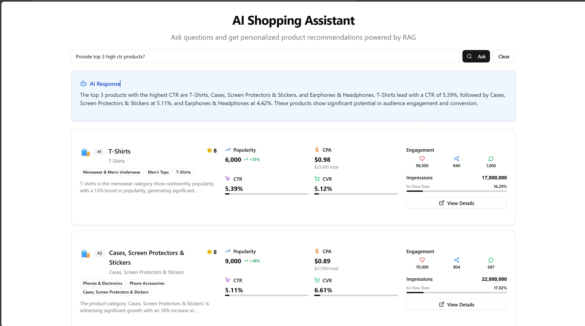

# Scraper FE (Vite + React + TypeScript)



This is a modern frontend project built with [Vite](https://vitejs.dev/), [React](https://react.dev/), and [TypeScript](https://www.typescriptlang.org/).

## Features

- Fast development with Vite
- Type-safe React components
- Organized folder structure (components, services, types, etc.)
- ESLint for code quality

## Getting Started

### 1. Clone the repository

```bash
# Using HTTPS
git clone https://github.com/CodeEx24/scraper-fe.git
# Or using SSH
git clone git@github.com:CodeEx24/scraper-fe.git
cd scraper-fe
```

### 2. Install dependencies

```bash
npm install
# or
yarn install
```

### 3. Set up environment variables

Copy `.env.example` to `.env` and update as needed (if applicable).

### 4. Run the development server

```bash
npm run dev
# or
yarn dev
```

The app will be available at [http://localhost:5173](http://localhost:5173) by default.

### 5. Build for production

```bash
npm run build
# or
yarn build
```

The output will be in the `dist/` folder.

## Project Structure

```
src/
  assets/           # Static assets
  components/       # Reusable React components (UI, ProductList, etc.)
  lib/              # Utility functions
  services/         # API/data fetching logic
  types/            # TypeScript types and interfaces
  App.tsx           # Main app component
  main.tsx          # Entry point
```

- **Types**: `src/types/product.ts`
- **API Services**: `src/services/ragService.ts`
- **UI Components**: `src/components/`

## Linting

To check code quality:

```bash
npm run lint
# or
yarn lint
```

## Customization

- Update environment variables in `.env` as needed.

```
VITE_API_URL=<your-api-endpoint>
```

- Adjust API endpoints in `src/services/ragService.ts`.

## License

MIT
